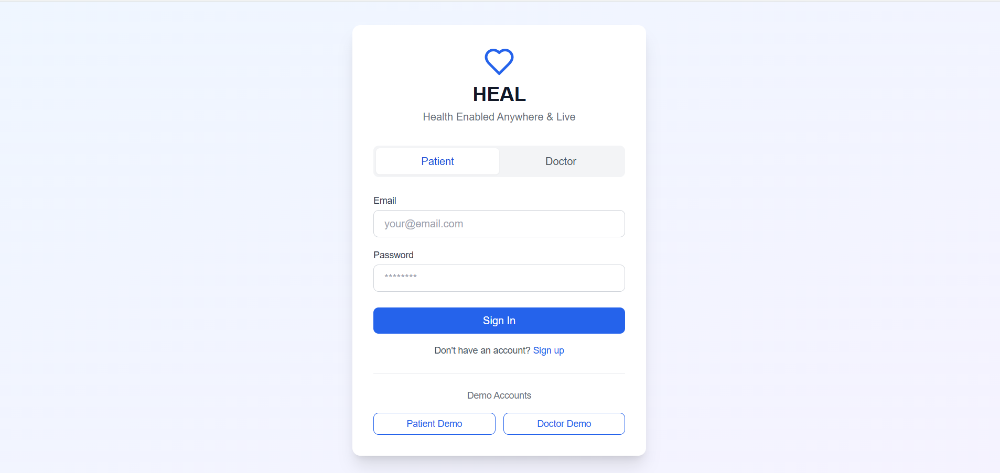
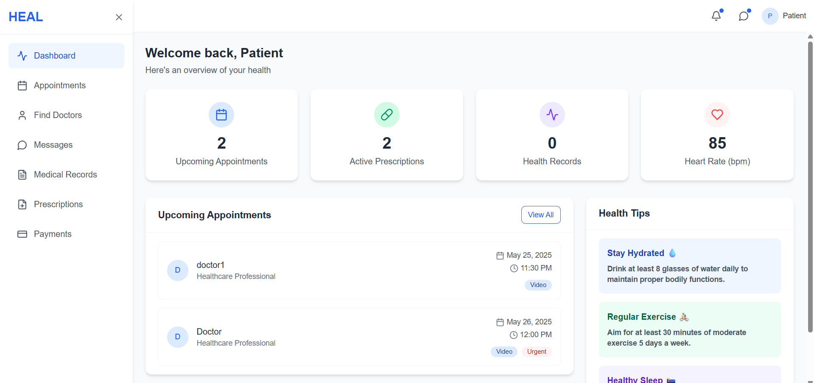
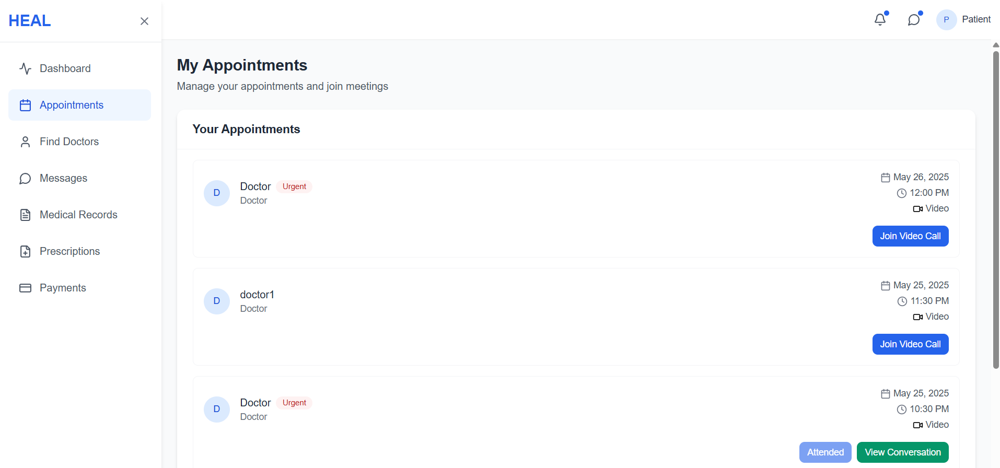
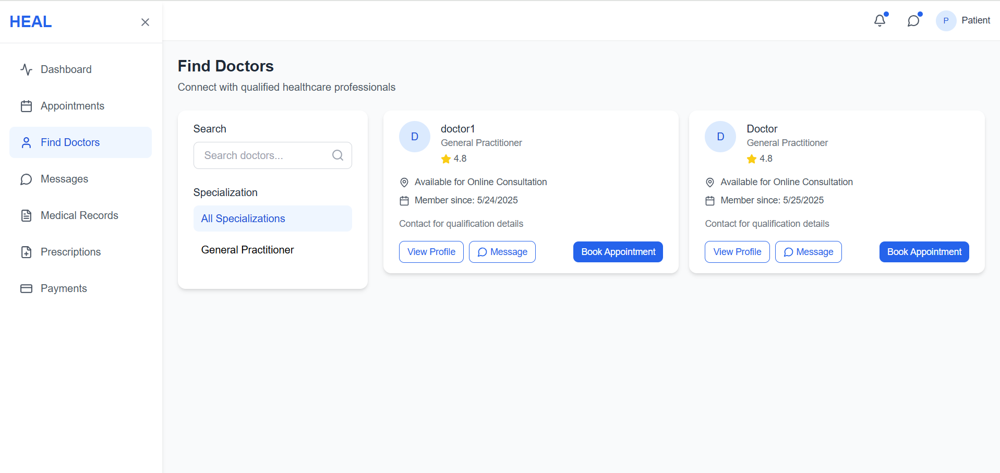
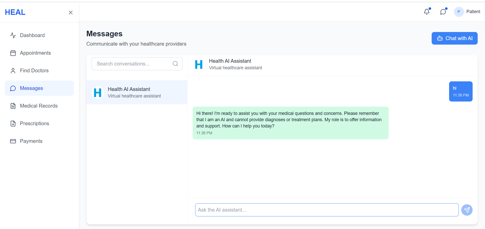
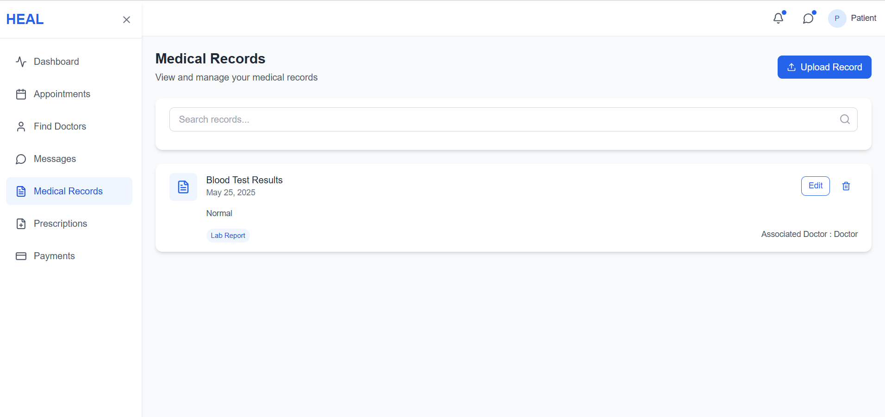
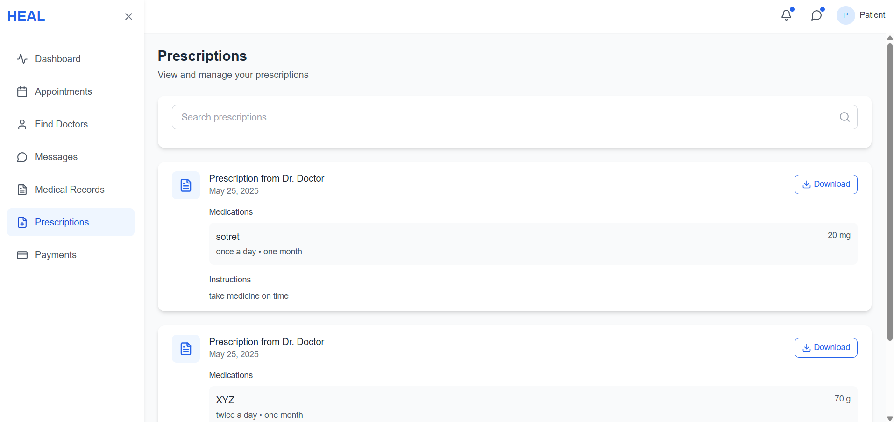
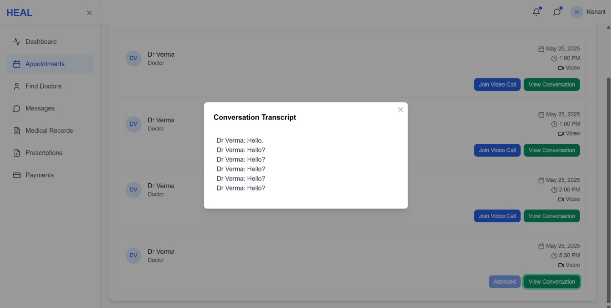

# H.E.A.L. – Health Enabled Anywhere & Live  
**Version:** 1.0  
**Team:** Liv2Code – MSIT  

---

## 🩺 Overview

**H.E.A.L. (Health Enabled Anywhere & Live)** is a real-time telehealth platform designed to bridge the gap between healthcare providers and patients through virtual consultations. It replicates the in-clinic experience remotely, providing:

- Video consultations
- Real-time transcription
- Appointment booking
- AI chatbot support
- Online payments & history
- Medical records management 
- Prescription records management 

---

## 🎥 Demo & UI Prototype

- **Demo Video:** https://www.youtube.com/watch?v=6398bJGjdlA
- **Deployed Frontend :** https://heal-frontend.vercel.app/
- **Figma UI Flow:** https://www.figma.com/design/7zbAJUWn47fjBOnql5KpvZ/HealFigma?node-id=0-1&t=999p6fqrwA18vEsx-1

---

## ✨ Features

- 🔐 Secure video/audio consultations (ZegoCloud)
- 🧠 Real-time voice transcription (DeepGram)
- 📃 Conversation History 
- 🤖 AI chatbot assistant (Gemini 2.0 Flash)
- 📝 Patient profile & medical history
- 💬 Real-time chat (Socket.IO)
- 💳 Secure payments (Square APIs)
- 📋 Session summaries
- 📑 Prescription management
- ✅ HIPAA & GDPR compliance

---

## 👥 User Roles

### Patients
- Register and log in
- Access doctors profile & Book consultations
- Join video calls with doctors
- Access past records and transcripts
- Chat and make secure payments
- Message with AI Assistant for personal queires ( Patient medical records had been added in System prompt )

### Doctors
- Authenticate and manage availability
- Conduct live consultations
- Access patient profile , history & prescriptions
- View real-time transcripts & conversation history


---

## Screenshots









## 🧰 Tech Stack

| Layer        | Technologies Used                           |
|--------------|----------------------------------------------|
| Frontend     | React, Next.js, TailwindCSS                  |
| Backend      | Node.js, Express                             |
| Database     | MongoDB, PostgreSQL                          |
| Realtime     | ZegoCloud, Socket.IO                         |
| AI Services  | Gemini AI, DeepGram                          |
| Payments     | Square APIs                                  |
| Auth         | OAuth, JWT                                   |
| Hosting      | Vercel                                       |

---

## 🔐 Security & Compliance

- Role-based access control
- JWT-based authentication
- Data encryption at rest & in transit ( Can be managed by Crypto.js )
- HIPAA & GDPR compliant

---

## 🛠️ Backend Routes

### ✅ Health Check

- `GET /health`  
  Example: [`https://heal-backend-one.vercel.app/health`](https://heal-backend-one.vercel.app/health)

---

### 🔐 Authentication Routes (`/auth`)

| Method | Route           | Description          |
|--------|------------------|----------------------|
| POST   | /register        | Register a new user  |
| POST   | /login           | Login user           |
| GET    | /verify-token    | Verify JWT token     |

---

### 👥 User Routes (`/users`)

| Method | Route        | Middleware     | Description              |
|--------|--------------|----------------|--------------------------|
| GET    | /            | `authMiddleware` | Get all users           |
| GET    | /:id         | `authMiddleware` | Get user by ID          |

---

### 💬 Conversation Routes (`/conversations`)

| Method | Route                  | Description                       |
|--------|------------------------|-----------------------------------|
| GET    | /                      | Get all conversations             |
| GET    | /unread                | Get unread message count          |
| GET    | /:id/messages          | Get messages by conversation ID   |
| POST   | /                      | Start a new conversation          |

---

### 📅 Appointment Routes (`/appointments`)

| Method | Route                         | Description                            |
|--------|-------------------------------|----------------------------------------|
| GET    | /:userId                      | Get appointments by user ID            |
| POST   | /                             | Create new appointment                 |
| PUT    | /:appointmentId               | Update appointment status              |

---

### 📝 Medical Records Routes (`/medical-records`)

| Method | Route                        | Description                            |
|--------|------------------------------|----------------------------------------|
| POST   | /                            | Create new medical record              |
| GET    | /:patientId                  | Get records for a specific patient     |
| DELETE | /:recordId                   | Delete a medical record                |
| PUT    | /:recordId                   | Update a medical record                |
| POST   | /upload                      | Upload a file (e.g., reports, scans)   |

---

### 💳 Payment Routes (`/payments`)

| Method | Route                                      | Description                          |
|--------|--------------------------------------------|--------------------------------------|
| GET    | /square-config                             | Get Square payment config            |
| POST   | /makePayment                               | Make a new payment                   |
| GET    | /:userId/history                           | Get user payment history             |
| GET    | /totalPaidByPatient/:userId                | Get total amount paid by patient     |

---

### 🧠 AI Response Route (`/ai-response`)

| Method | Route | Description         |
|--------|-------|---------------------|
| POST   | /     | Generate AI response|

---

### 💊 Prescription Routes (`/prescriptions`)

| Method | Route    | Description                        |
|--------|----------|------------------------------------|
| POST   | /        | Create a prescription              |
| GET    | /        | Get prescriptions by user ID       |
| PUT    | /:id     | Update a prescription              |
| DELETE | /:id     | Delete a prescription              |

---

### 📜 Transcription Routes (`/transcriptions`)

| Method | Route                                      | Description                       |
|--------|--------------------------------------------|-----------------------------------|
| GET    | /chat-summary-all                          | Get all chat summaries            |
| GET    | /chat-summary/room/:roomId                 | Get summary by Room ID            |

---

## 🔌 Socket Services

### 🎤 Live Transcription Service
### 💬 Live Real time chat


## ⚙️ Installation (Developer Setup)

```bash
# Clone the repository
git clone https://github.com/yourusername/HEAL-Telehealth.git
cd HEAL-Telehealth

# Install dependencies
npm install

# Add required environment variables
touch .env
# (Add API keys for DeepGram, Gemini, Zego, Square, etc.)

# Run the development server
npm run dev
